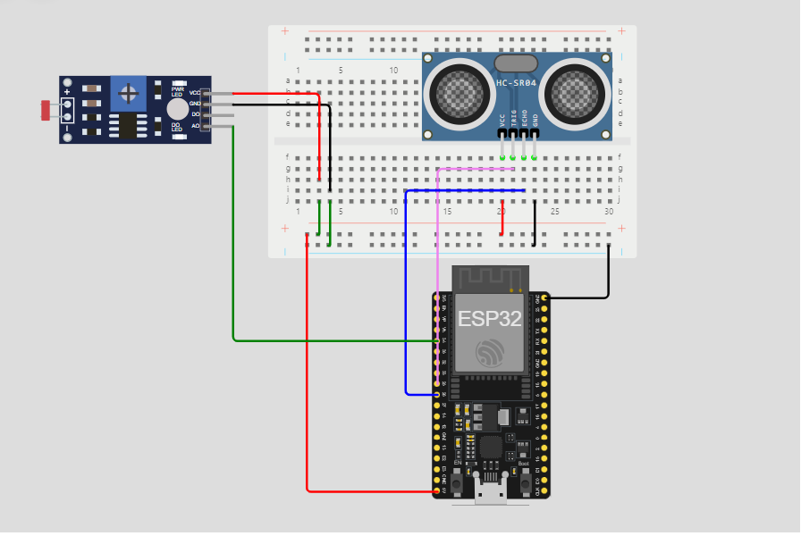
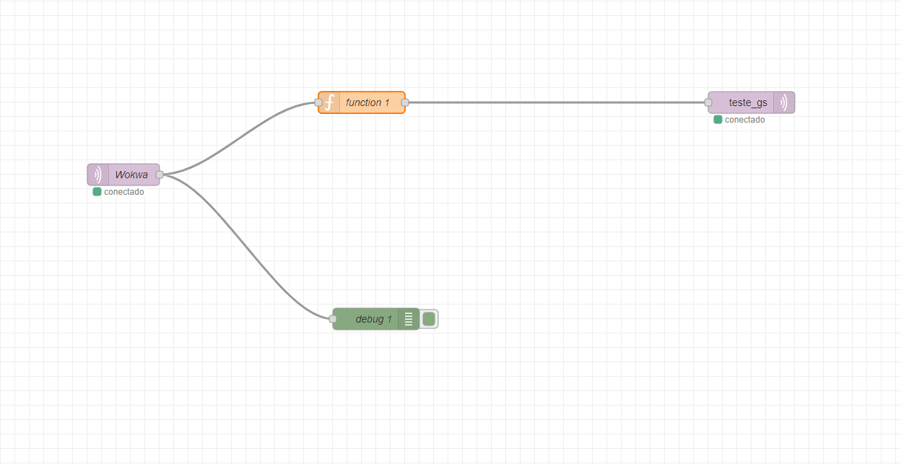
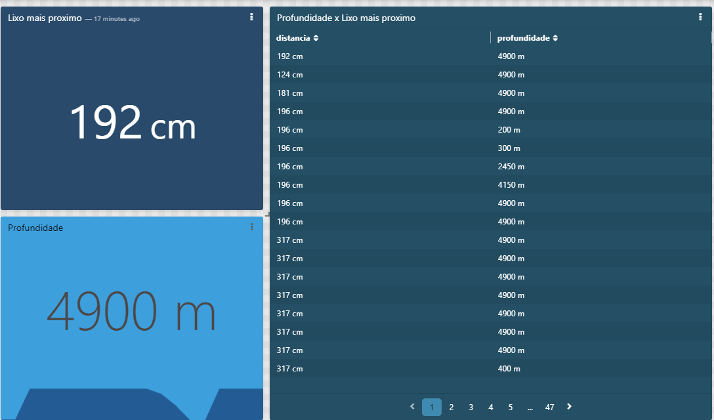

<h1 align="center">Ano 1 - Semestre 2 - Global Solutions - 1ESPR</h1>

  <a href="#pushpin-Introdução">Introdução</a>
  &nbsp;&nbsp;&nbsp;|&nbsp;&nbsp;&nbsp;
  <a href="#bulb-Desafio">Desafio</a>
  &nbsp;&nbsp;&nbsp;|&nbsp;&nbsp;&nbsp;
  <a href="#hammer_and_wrench-Tecnologias-e-Ferramentas">Tecnologias e Ferramentas</a>
  &nbsp;&nbsp;&nbsp;|&nbsp;&nbsp;&nbsp;
  <a href="#floppy_disk-Solução">Solução</a>
  &nbsp;&nbsp;&nbsp;|&nbsp;&nbsp;&nbsp;
  <a href="#gear-Como-Utilizar">Como Utilizar</a>
  &nbsp;&nbsp;&nbsp;|&nbsp;&nbsp;&nbsp;
  <a href="#technologist-Integrantes">Integrantes</a>

## :pushpin: Introdução
Este projeto tem como objetivo construir um dispositivo capaz de medir a concentração de sujeira no mar em diferentes profundidades.

## :bulb: Desafio
Construção de uma solução de IoT que abrange todos os conceitos de comunicação entre sensores e a plataforma TagoIO. A solução deve realizar a leitura de dois sensores a cada 2000ms, disponibilizando as leituras na porta serial e enviando os dados para o TagoIO no formato JSON. Além disso, deve haver dashboards no TagoIO cuja interface gráfica demonstre o funcionamento dos sensores de temperatura e distância, permitindo o monitoramento da quantidade de lixo através da distância até o objeto mais próximo e o nível de profundidade daquele ponto através da luminosidade.

## :hammer_and_wrench: Tecnologias e Ferramentas
Este projeto utilizou as seguintes tecnologias e ferramentas:
* [Node-RED](https://nodered.org/)
* [C++](https://pt.wikipedia.org/wiki/C%2B%2B)
* [Tago](https://tago.io/)
* [Wokwi](https://wokwi.com/)

## :floppy_disk: Solução
### Circuito
<h4>Componentes</h4>
<ul>
  <li><b>ESP32</b>: uma placa microcontroladora de código aberto.</li>
  <li><b>Sensor Ultrassônico(HC-SR04)</b>: dispositivo que emite ondas sonoras de alta frequência e mede o tempo que levam para essas ondas serem refletidas para um objeto.</li>
  <li><b>LDR</b>: um resistor cuja resistência varia conforme a intensidade da luz que incide sobre ele.</li>
</ul>
<table>
  <tr>
    <td>
      
    </td>
  </tr>
</table>

### Fluxo

<h6>Acesse o JSON para importação no Node-RED clicando <a href="./flows.json">aqui</a>.</h6>

### Dashboard

## :gear: Como Utilizar
1. Instalar o [Node-RED](https://nodered.org/);
2. Acessar o circuito montado no [Wokwi](https://wokwi.com/projects/400038510389570561);
5. Iniciar o [Node-RED](https://nodered.org/) no computador;
6. Importar o [fluxo](https://github.com/studies2023-FIAP-ES-553521-ano1-05-EDG/sem2-checkpoint1/blob/main/flows.json) no [Node-RED](https://nodered.org/) no computador e fazer o deploy.

## :technologist: Integrantes
* RM 553377 - Enzo de Oliveira Rodrigues
* RM 552939 - Jonata Rafael
* RM 553403 - Matheus Felippe

## Video explicativo

